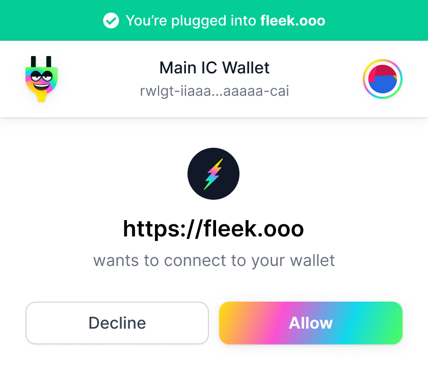

# Integrate Plug


## Browser extension

Interacting with the [Plug](https://plugwallet.ooo/) browser extension is made simple by the [IC Provider API](https://github.com/Psychedelic/plug-inpage-provider), an API that Plug injects into websites to allow them to call Plug and interact with the extension.

Get started by adding the extension in the browser, or if you already done so make sure that is enabled in the "extensions" or "Add-ons" menu of your browser!

Pin the Plug extension to the browser bar for easy access (here's an example of how to do it in [Chrome](https://support.google.com/chrome_webstore/answer/2664769?hl=en-GB)).

Once the [Plug](https://plugwallet.ooo/) extension is installed, a `Plug` object is available as a property of `window.ic` in the browser window or tabs. Your application will be able to detect the extension by checking the `window` object and if available, interact with it!

## Console playground

Once you have the Plug extension, run a quick test to detect it by opening the browser developer console (here's an example for [Chrome](https://developer.chrome.com/docs/devtools/open/) and [Firefox](https://developer.mozilla.org/en-US/docs/Tools/Browser_Console)). Note that if you just installed Plug you need to **refresh the page (F5 on Windows)** so that Plug is detected correctly.

Copy and paste the following code snippet into the console and execute it by pressing the `ENTER` key of your keyboard.

```js
window.ic.plug && "Plug and play!"
```

The result output should be `Plug and play!`, if you have Plug installed correctly!

If you get an `error`, you're advised to check the installation instructions for [Plug](https://plugwallet.ooo/) and ensure that you have the extension installed correctly!

## Plug window object

Plug provides a simple API to websites and webapps at `window.ic.plug`, enabling them to "talk to" the Internet computer via Plug.

As we continue to develop features and make them available, the API will let you:

- Detect the Plug extension
- Interact and authenticate an account
- Query data from the Internet Computer
- Trigger a transaction for the end-user approval

As previously noted, we can interact directly with the API through our browser developer console.

Copy and paste the following code snippet into the console and execute it:

```js
window.ic.plug.requestConnect()
```

> Because of browser security restrictions, access to the Plug extension API is only allowed from pages accessed via HTTP. You'd be allowed to interact with it via the current documentation [page](https://docs.plugwallet.ooo/getting-started/connect-to-plug/), but not the default options page `chrome-extension://xxxx/options.html`, for example.

A `Plug notification` window will pop-up, displaying the following interface that requesting the user to `Allow` or `Decline` the connection to their wallet:

{: style="max-width:360px"}

After you `Allow` or `Decline`, the notification popup will close!

To understand how to read the response data for the `requestConnect` call and any other [asynchronous](https://developer.mozilla.org/en-US/docs/Learn/JavaScript/Asynchronous) method, read below.

## Available interactions and methods

### requestConnect

requestConnect() is an [asynchronous](https://developer.mozilla.org/en-US/docs/Learn/JavaScript/Asynchronous) method to request a new connection by showing a pop-up to the Plug user, that resolves to Boolean: `true` or `false` based on the users response.

As an example, copy and paste the following code snippet into the console and execute it.

Select `Allow` or `Decline` on the pop-up and you should see the corresponding result (Allowed or Declined) in the console.

```js
(async () => {
  const result = await window.ic.plug.requestConnect();
  const connectionState = result ? "allowed" : "denied";
  console.log(`The Connection was ${connectionState}!`);
})();
```

### isConnected()

isConnected() is an [asynchronous](https://developer.mozilla.org/en-US/docs/Learn/JavaScript/Asynchronous) method to check the connection status, that returns a Boolean: `true` or `false`.

```js
(async () => {
  const result = await window.ic.plug.isConnected();
  console.log(`Plug connection is ${result}`);
})()
```

### requestBalance()

requestBalance() is an [asynchronous](https://developer.mozilla.org/en-US/docs/Learn/JavaScript/Asynchronous) method to request the user's ICP wallet balance, which is consulted in the [Internet Computer's Ledger Canister](https://sdk.dfinity.org/docs/integration/ledger-quick-start.html#_ledger_canister_overview) for ICP, returning the amount of ICP the user's wallet in Plug holds:

```js
Array [{
  amount: number,
  currency: string,
  image: string,
  name: string,
  value: number,
}]
```

As an example, copy and paste the following code snippet into the console and execute it.

```js
(async () => {
  const result = await window.ic.plug.requestBalance();
  console.log(result);
})();
```

### requestTransfer(SendICPTsArgs)

requestTransfer() is an [asynchronous](https://developer.mozilla.org/en-US/docs/Learn/JavaScript/Asynchronous) method to request a new Transfer processed in the Internet Computer [Ledger Canister](https://sdk.dfinity.org/docs/integration/ledger-quick-start.html#_ledger_canister_overview), which takes the parameter `SendICPTsArgs` that is an object of fields:

SendICPTsArgs:
- to
- amount
- opts (optional)

SendOpts:
- fee
- memo
- from_subaccount
- created_at_time

TimeStamp:
- timestamp_nanos

```js
Object {
  to: String,
  amount: BigInt,
  opts?: {
    fee?: BigInt,
    memo?: BigInt,
    from_subaccount?: Number,
    created_at_time?: {
      timestamp_nanos: BigInt
    },
  },
}
```

As an example, copy and paste the following code snippet into the console and execute it (replacing the `xxxx-xxxx-xxxx-xxxx` with your `Principal ID`):

```js
(async () => {
  const params = {
    to: 'xxxxx-xxxxx-xxxxx-xxxxx',
    amount: 2_000_000,
  };
  const result = await window.ic.plug.requestTransfer(params);
  console.log(result);
})();
```
--------

We're currently working hard to bring more features and plan to release them as soon as they become ready. The project is open-source and you are very welcome to participate or follow the progress!

Hope you enjoyed the read so far and got a basic understanding of how to integrate Plug to your site/app or interact with it.